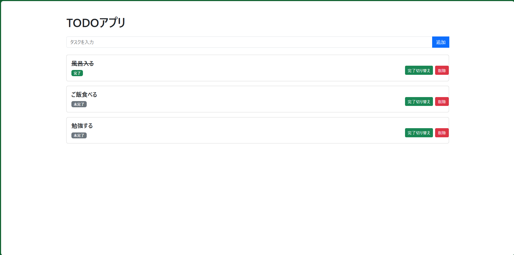

 # **TODOアプリ**

 FastAPIとJavaScriptを使って作成したTODOアプリです。
タスクの追加・一覧表示・完了・削除ができます。

## 主な機能

- タスクの追加
- タスクの一覧表示
- タスクの完了・未完了の切り替え
- タスクの削除

## 使用技術

- Python
- FastAPI
- SQLAlchemy
- SQLite
- HTML
- CSS
- JavaScript

## 画面イメージ

※ ここにアプリのスクリーンショットを追加する予定です。

## 起動方法

### 1.リポジトリをクローン

git clone https://github.com/kimuchota-maker/todo-app.git cd todo-app

### 2.仮想環境を作成

python3 -m venv venv

### 3.仮想環境を有効化

source venv/bin/activate

### 4.必要なライブラリをインストール

pip install fastapi uvicorn sqlalchemy jinja2

### 5.アプリを起動

uvicorn main:app --reload

### 6.ブラウザでアクセス

https:127.0.0.1:8000

## 公開URL

https://todo-app-u4zn.onrender.com

## 今後追加したい機能
- タスクの編集
- 期限の設定
- カテゴリ分け
- ログイン機能

